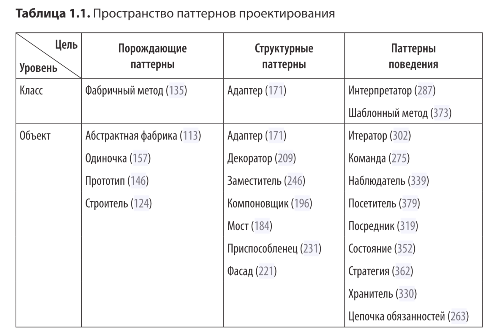
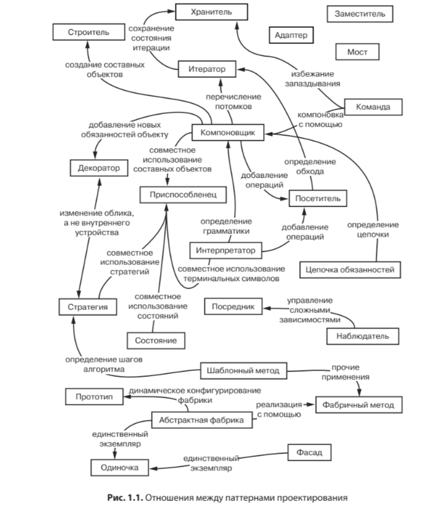
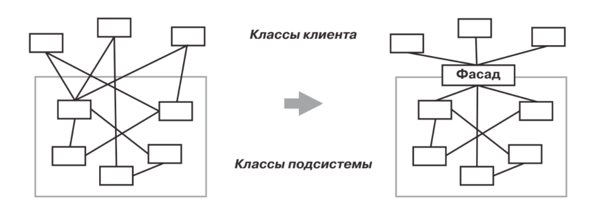
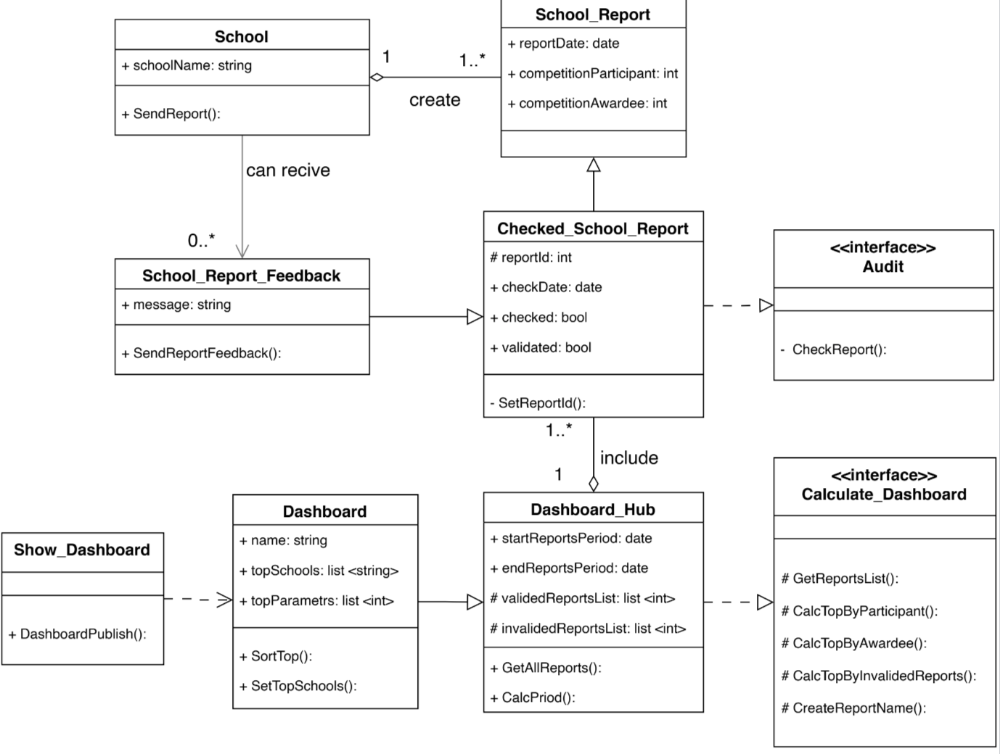
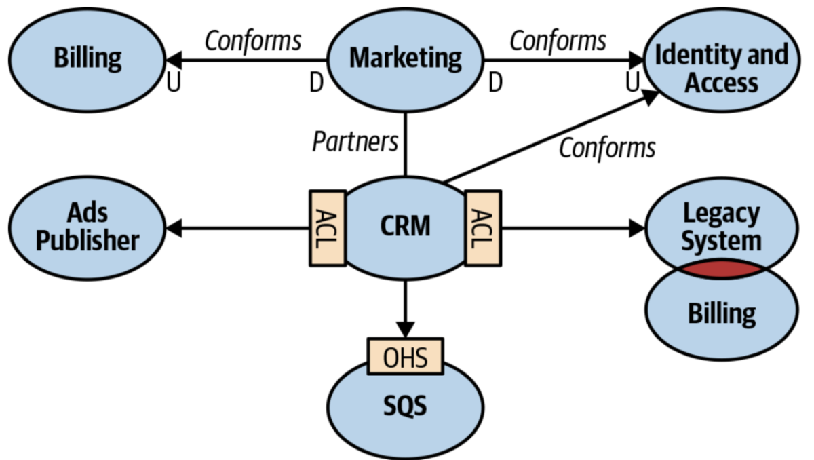

# Проектирование архитектуры информационных систем
По состоянию на март 2024 у меня мало знаний в части [архитектуры ПО](https://agaltsovav.ru/docs/architecture/), но это то направлени в котором я хочу развиваться.
Начинаю экспиремент по совмещению техник и инструментов Предметно-Ориентированного Проектирование и Объектно-Ориентированного Программирования. 
Мотивцией послужило выгорание при работе над текущим проектом и желание погрузиться в изучение UML и python. 
В процессе экспиремента так же считаю необходимым изучение [паттернов проектирования](https://github.com/pkolt/design_patterns?tab=readme-ov-file).

## Уверен, что домен можно объеденить в абстрактный класс нижнего/глубинного уровня, который в последствие детализируется. Я пока не нашел/дочитал до подтверждения.

## План экспиримента (последовательность шагов не является строгой):
1. На практике погрузиться в ОО Программирование и прочитать книгу «Паттерны объектно-ориентированного проектирования»
2. Использовать связки **С4 и plantUML** [1](https://github.com/plantuml-stdlib/C4-PlantUML), [2](https://github.com/team7katas/sysopsquad) и оставлять шаблоны в специальном репозитории для дальнейшего переиспользования
3. Погрузиться в ПО Проектиование, прочитав книгу [«Что такое предметно-ориентированное проектирование?"](https://systems.education/what-is-domain-driven-design) и практиковать Event Storming, по-возможности
4. Написать ТЗ для пет-проекта используя обе практики
5. Релализовать пет-проект (в том числе с привлеченим аутсорса), используя микросервисную архитектуру

***

## Глава 1. Погружение в ООП
> *Объект - коллекция/набор данных и поведения ИЛИ данные с ассоциируемым поведением.*
> 
 Объектно-ориентированный Python (4 издание) // Стивен Ф. Лотт, Дастин Филлипс // стр. 24 

> *Ключевая задача моделирования объекта в объектно-ориентированном про­ ектировании - определить, какой будет внешний интерфейс данного объекта. Интерфейс - коллекция, набор атрибутов и методов, доступных для взаимо­ действия с другими объектами.*
> 
 Объектно-ориентированный Python (4 издание) // Стивен Ф. Лотт, Дастин Филлипс // стр. 33 

Я знаком с базовыми концепциями ООП, но всегда избегал его при написании кода, чтобы исправиться начну рефакторинг кода для игры ["Висилеца"](https://github.com/sqrt495/OOP-python-learning/blob/main/Hangman.ipynb) написанного мной после знакомства с курсом самообучения от [Сергея Жукова](https://zhukovsd.github.io/python-backend-learning-course/).

### 1.1 Знакомство с паттернами ООП 

> *Мы будем классифицировать паттерны по двум критериям. Первый — цель — отражает назначение паттерна. Паттерны делятся на порождающие, структурные и паттерны поведения. Первые связаны с процессом создания объектов. Вторые имеют отношение к композиции объектови классов. Паттерны поведения характеризуют то, как классы или объекты взаимодействуют.
Второй критерий — уровень — сообщает, к чему обычно применяется паттерн: к объектам или классам. Паттерны уровня классов описывают отношения между классами и их подклассами. Такие отношения выражаются с помощью наследования, поэтому они статичны, то есть зафиксированы на этапе компи￾ляции. Паттерны уровня объектов описывают отношения между объектами, которые могут изменяться во время выполнения и потому более динамичны. Почти все паттерны в какой-то мере используют наследование. Поэтому к категории «паттерны классов» отнесены только те, что концентрируются лишь на отношениях между классами. Обратитевнимание: большинство паттернов действует на уровне объектов.
Существуют и другие способы классификации паттернов. Некоторые паттерны часто используются вместе. Например, 'компоновщик' применяется с 'итератором' или 'посетителем'. Некоторыми паттернами предлагаются альтернативные решения. Так, 'прототип' нередко можно использовать вместо 'абстрактной фабрики'. Применение части паттернов приводит к схожему дизайну, хотя изначально их назначение различно. Например, структурные диаграммы 'компоновщика' и 'декоратора' похожи.*
> 
 Паттерны объектно-ориентированного проектирования (издание 2020) // Э. Гамма, Р. Хелм, Р. Джонсон, Дж. Влиссидес // стр. 28 

  

 

  

> *Объект сочетает данные и процедуры для их обработки. Такие процедуры обычно называют методами или операциями. Объект выполняет операцию, когда получает запрос (или сообщение) от клиента.
Отправка запроса — это единственный способ заставить объект выполнить операцию. А выполнение операции — единственный способ изменить внутреннее состояние объекта. Из-за этих двух ограничений говорят, что внутреннее состояние объекта инкапсулировано: к нему нельзя обратиться напрямую, а его представление невидимо за пределами объекта.*
> 
 Паттерны объектно-ориентированного проектирования (издание 2020) // Э. Гамма, Р. Хелм, Р. Джонсон, Дж. Влиссидес // стр. 29 

> *Для любой операции, объявляемой объектом, должны быть заданы: имя операции, объекты, передаваемые в качестве параметров, и значение, возвращаемое операцией. Эту триаду называют сигнатурой операции.*
> 
 Паттерны объектно-ориентированного проектирования (издание 2020) // Э. Гамма, Р. Хелм, Р. Джонсон, Дж. Влиссидес // стр. 32 

> *Для любой операции, объявляемой объектом, должны быть заданы: имя операции, объекты, передаваемые в качестве параметров, и значение, возвращаемое операцией. Эту триаду называют сигнатурой операции.* 
> 
 Паттерны объектно-ориентированного проектирования (издание 2020) // Э. Гамма, Р. Хелм, Р. Джонсон, Дж. Влиссидес // стр. 32 

> **Предпочитайте композицию наследованию класса!**
> 
 Паттерны объектно-ориентированного проектирования (издание 2020) // Э. Гамма, Р. Хелм, Р. Джонсон, Дж. Влиссидес // стр. 40 

> *3 способа комбинировать поведение в объектно-ориентированных системах* 
> *1 наследования класса*  
> *2 композиции объектов* 
> *2.1 Делегирование — особый случай композиции. Оно показывает, что наследование как механизм повторного использования всегда можно заменить композицией.* 
> *3 Параметризованные типы* 
> *Но между этими тремя подходами есть важные различия. Композиция объектов позволяет изменять поведение во время выполнения, но для этого требуются косвенные вызовы, что снижает эффективность. Наследование разрешает предоставить реализацию по умолчанию, которую можно замещать в подклассах. Параметризованные типы позволяют изменять типы используемые классом. Но ни наследование, ни параметризованные типы не могут изменяться во время выполнения. Выбор того или иного подхода зависит от проекта и ограничений реализации.* 
> 
 Паттерны объектно-ориентированного проектирования (издание 2020) // Э. Гамма, Р. Хелм, Р. Джонсон, Дж. Влиссидес // стр. 43 

> *Рассмотрим различие между агрегированием и осведомленностью (acquaintance) объектов и его проявления на этапах компиляции и выполнения. Агрегирование подразумевает, что один объект владеет другим или несет за него ответственность. В общем случае мы говорим, что объект содержит другой объект или является его частью. Агрегирование означает, что агрегат и его составляющие имеют одинаковое время жизни. Говоря же об осведомленности, мы имеем в виду, что объекту известно о другом объекте. Иногда осведомленность называют ассоциацией или отношением «использует». Осведомленные объекты могут запрашивать друг у друга операции, но они не несут никакой ответственности друг за друга. Осведомленность — это более слабое отношение, чем агрегирование; оно предполагает гораздо менее тесную связь между объектами.* 
> 
 Паттерны объектно-ориентированного проектирования (издание 2020) // Э. Гамма, Р. Хелм, Р. Джонсон, Дж. Влиссидес // стр. 44

#### 1.1.1 Фасад

> *Фасад — паттерн, структурирующий объекты. Предоставляет унифицированный интерфейс вместо набора интерфейсов некоторой подсистемы. Фасад определяет интерфейс более высокого уровня, который упрощает использование подсистемы. Разбиение на подсистемы облегчает проектирование сложной системы в целом. 'Фасад' предоставляет единый упрощенный интерфейс к более сложным системным средствам — аозволяет свести кминимуму зависимость подсистем друг от друга и обмен информацией между ними.*
> 
 Паттерны объектно-ориентированного проектирования (издание 2020) // Э. Гамма, Р. Хелм, Р. Джонсон, Дж. Влиссидес // стр. 221

 

  

> Основные достоинства паттерна фасад:
> * позволяет ослабить связанность между подсистемой и ее клиентами, изолирует клиентов от компонентов подсистемы;
> * фасад не препятствует приложениям напрямую обращаться к классам подсистемы, если это необходимо - таким образом, у вас есть выбор между простотой и общностью.
> 
 Паттерны объектно-ориентированного проектирования (издание 2020) // Э. Гамма, Р. Хелм, Р. Джонсон, Дж. Влиссидес // стр. 224

***

### 1.2 UML Диаграмма классов

Условия задания: 
 
В городе ввели Департамент развития талантов школьников. Каждая школа по окончанию учебного года присылает данные: количество школьников, которые выступали на олимпиадах и количество школьников, которые заняли призовые места на олимпиадах. После получении данных от школ в процесс вмешивается Служба аудита, которая по своим источникам может поставить под сомнение данные, которые прислала конкретная школа. Например, по их сведениям в олимпиадах не побеждали дети от школы, а по переданным данным - побеждали. Внутренняя кухня Службы аудита нас не интересует, важно что они могут отметить данные от школы как сомнительные.  Эту обратную связь мы передаем школе, и она может повторно направить скорректированные данные в Департамент.
Необходимо разрабатать Дашборд с двумя таблицами.
 
1. Топ школ по количеству олимпиадников и победителей олимпиад по школам (данные, которые не вызывают сомнения у Службы аудита).
2. Топ школ, присылающих сомнительные данные по количеству корректировок
 
Задача:
 
Необходимо разработать диаграмму классов, которая позволит обеспечить формирование Дашборда.

Решение:
 

 

***

## Глава 2. Погружение в DDD
*Проблемно-ориентированное проектирование (DDD) — это набор принципов и схем, помогающих разработчикам создавать изящные системы объектов. При правильном применении оно приводит к созданию программных абстракций, которые называются моделями предметных областей. В эти модели входит сложная бизнес-логика, устраняющая промежуток между реальными условиями бизнеса и кодом.*
 
*Сущность — это «штука» в вашей системе. О них часто удобно думать существительными: люди, места и, ну, штуки.*
 
*У сущностей есть и индивидуальность, и жизненный цикл.*
 
*Думайте о сущностях скорее как о единицах поведения, нежели как о единицах данных. Попробуйте поместить логику в сущности, которые ей принадлежат. Чаще всего какие-то операции, которые вы пытаетесь добавить в модель, должна получить какая-то сущность, или при этом начинает создаваться или извлекаться новая сущность. В более слабом коде можно найти массу служебных или управляющих классов, проверяющих сущности снаружи. В целом я предпочитаю делать это изнутри сущности — вы получаете все преимущества, связанные с фундаментальным принципом инкапсуляции, а сущности приобретают поведение.*
 
**[Learn / MSDN Magazine Issues / 2009 / Февраль](https://learn.microsoft.com/ru-ru/archive/msdn-magazine/2009/february/best-practice-an-introduction-to-domain-driven-design)**
 
 
*Предметная область (или бизнес-область, сфера бизнеса, business domain) определяет общую сферу деятельности компании. В общем смысле, это услуга, которую компания предоставляет своим клиентам.*
 
*Компания может работать в нескольких предметных областях. Например, Amazon предоставляет как услуги розничной торговли, так и облачные сервисы. Uber — это компания по организации поездок, которая также предоставляет услуги по доставке еды и совместному использованию велосипедов.*
 
**[What is Domain-Driven Design? // Анализ предметных областей](https://systems.education/wis-ddd-business-domains)**

*Существуют паттерны предметно-ориентированного проектирования, которые определяют способы интеграции и отношений между ограниченными контекстами. Эти паттерны определяются исходя из типа взаимодействия между командами, которые работают над ограниченными контекстами. Мы разделим паттерны на три группы, каждая из которых представляет тип командного взаимодействия: сотрудничество, заказчик-поставщик и раздельные пути.*
 

 
**[What is Domain-Driven Design? // Сопоставление контекстов](https://systems.education/wis-ddd-context-mapping)**

### Ограниченный контекст
Нужно разделить единый язык на несколько языков поменьше, а затем каждый из них привязать к явному контексту, в котором он может быть применен — его ограниченному контексту. В каком-то смысле конфликты терминологии и неявные контексты являются неотъемлемой частью любого крупного бизнеса. С использованием паттерна ограниченного контекста, они моделируются как явная и неотъемлемая часть предметной области.
